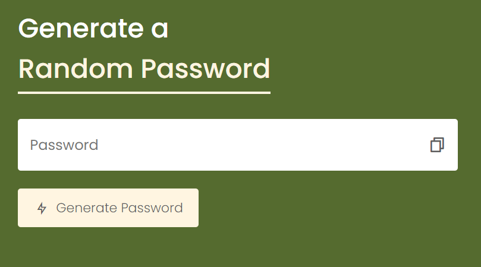
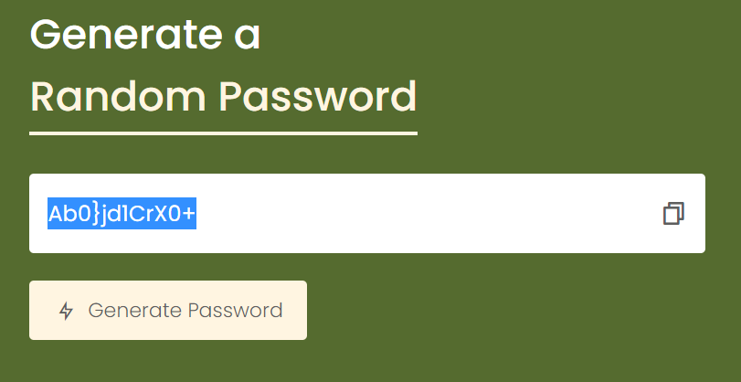

# Random Password Generator README

Welcome to the Random Password Generator project repository! This web application is a handy tool created using HTML, CSS, and JavaScript. It allows users to generate strong and random passwords for enhanced online security.

## Table of Contents
- [Introduction](#introduction)
- [Features](#features)
- [Installation](#installation)
- [Usage](#usage)
- [Technologies Used](#technologies-used)
- [Screenshots](#screenshots)
- [Contributing](#contributing)
- [License](#license)

## Introduction
The Random Password Generator is a project developed by Thembi as part of my journey in upskilling in web development. It aims to simplify the process of creating secure passwords for online accounts, helping users enhance their digital security.

## Features
- **Customization:** Users can customize the password length and select which character types (uppercase, lowercase, numbers, symbols) to include.
- **Secure Passwords:** The generator ensures that the generated passwords are strong and include a mix of characters.
- **Copy to Clipboard:** Users can easily copy the generated password to their clipboard for immediate use.

## Installation
To run the Random Password Generator locally, follow these steps:

1. Clone this repository:
   ```
   git clone https://github.com/ngww/password-generator.git
   ```

2. Navigate to the project directory:
   ```
   cd password-generator
   ```

3. Open the `index.html` file in your preferred web browser.

## Usage
1. Open the app in your browser.
2. Customize your password preferences by selecting the desired options.
3. Click the "Generate Password" button.
4. Your randomly generated password will appear in the designated area.
5. Click the "Copy to Clipboard" button to copy the password for use in your accounts.

## Technologies Used
- HTML5
- CSS3
- JavaScript

## Screenshots
[Live Demo](https://password-generator-ngww.vercel.app)




## Contributing
Contributions to the Random Password Generator project are welcome! If you have ideas for new features or improvements, please feel free to create a pull request. Ensure that your contributions align with the project's goals.

## License
This project is licensed under the [MIT License](LICENSE).

---

Thank you for exploring the Random Password Generator! It's a valuable tool for enhancing online security by creating strong and unique passwords. If you have any questions or suggestions, feel free to contact me via twitter at @ngwcodes. Enjoy generating secure passwords!